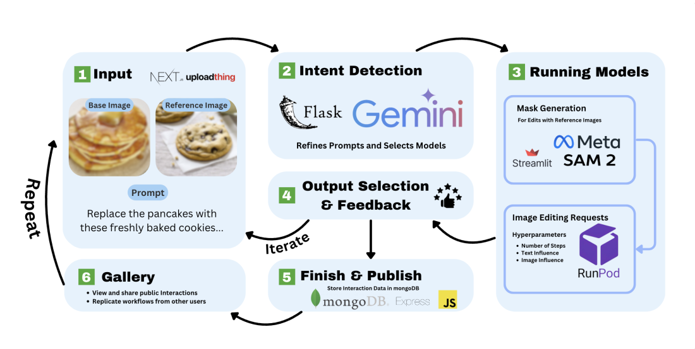

# HILITE: Human-in-the-loop Interactive Tool for Image Editing

You may access the paper [here](https://ieeexplore.ieee.org/document/10825916).

**Abstract**
---
In this work, we introduce HILITE, an open-source interactive image editing platform with a human-in-the-loop design that combines six diffusion-based image editing models. For one, HILITE’s accessible and easily-understandable user interface provides a straightforward user workflow from image input and prompt entry to selection of desired output. Secondly, the combination of several models with diverse specializations in turn allows HILITE to generalize on a wide variety of image editing tasks, essentially creating a “one-stop shop” for image editing. Third, HILITE iteratively takes user feedback, which both enhances the user experience and enables collection of crowd-sourced data for image editing. HILITE outperforms two major image editing softwares, OpenAI’s DALL·E 3 and Google’s Imagen 3, across two widely-user quantitative metrics for image editing evaluation. Considering the growing demand for readily-available and high-performing image editing tools, HILITE provides a novel platform design with multifaceted use cases in both business and academia. The platform can be found at https://platform.opennlplabs.org/ or https://platform-deployment.vercel.app/.



HILITE was developed by researchers from OpenNLP Labs in collaboration with Stanford's SALT Lab and CMU's NeuLab. We are extremely grateful for the support and contributions of our mentors Simran Khanuja, Yutong Zhang, Diyi Yang, Graham Neubig, and Subha Vadlamannati in this work.


**Setting up HILITE using your own services**
---
HILITE consists of the following components:

- **Frontend**  
- **Backend**  
- **Intent**: Detects user intent, refines user prompts, and routes requests to suitable models
- **Canvas**: Streamlit canvas to obtain masks for reference-image-based models

Ensure you have Node.js v20.10.0 and Python 3.12.4 installed.

**Frontend**
---

**Next.js** • **Tailwind CSS** • **DaisyUI** • **Uploadthing** • **OAuth 2.0**

**Environment Variables**

```
NEXT_PUBLIC_EXPRESS_BACKEND_URL=
NEXT_PUBLIC_INTENT_API_URL=
NEXT_PUBLIC_STREAMLIT_APP=
NEXT_PUBLIC_GOOGLE_OAUTH_CLIENT_ID=
UPLOADTHING_SECRET=
UPLOADTHING_TOKEN=
```
**Instructions**
1. Create a UploadThing secret and token [here](https://uploadthing.com/). UploadThing is a service for managing and uploaded files. Place these variables into `UPLOADTHING_SECRET=` and `UPLOADTHING_TOKEN=.`

2. [Instructions](https://developers.google.com/identity/gsi/web/guides/get-google-api-clientid) for obtaining a Google OAuth Client ID. The Client ID is required for managing HILITE's authentication. Place this in `NEXT_PUBLIC_GOOGLE_OAUTH_CLIENT_ID=.`

3. Place the .env file in the ```client``` folder. The other variables will be added once you run the Backend, Intent, and Canvas.


```bash
cd client

npm install # Install dependencies 

npm run dev # Run the development server. Make sure it is running on the default port 3000.
```


**Backend**
---

**Express.js** • **Node.js** • **MongoDB**

**Environment Variables**


```
MONGODB_URI=
RUNPOD_API_KEY=
```
**Instructions**

1. [Instructions](https://www.mongodb.com/resources/products/fundamentals/mongodb-connection-string) for obtaining a MongoDB URI (Connection String). HILITE uses MongoDB, a NoSQL database. Place the connection string in `MONGODB_URI=.`
   
2. [Instructions](https://docs.runpod.io/get-started/api-keys) for obtaining an API key for running models on RunPod's serverless service. Place this in `RUNPOD_API_KEY=.`
 
3. Place the .env file in the ```server``` folder


```bash
cd server

npm install # Install dependencies

node server.js # Run the backend server
```

**Intent**
---

**Flask** • **Gemini** • **LangChain**


**Environment Variables**


```
GOOGLE_API_KEY=
```
**Instructions**

1. [Instructions](https://support.google.com/googleapi/answer/6158862?hl=en) for obtaining a Google API key. Ensure the Generative Language API is enabled to use Gemini 2.0 Flash. Place the API key in `GOOGLE_API_KEY=.`

2. Place the .env file in the ```intent``` folder


```bash
cd intent

pip install -r requirements.txt # Install dependencies

python intent.py # Run the Flask server
```


**Canvas**
---

**Streamlit**

**Environment Variables**


```
BACKEND_URL= 
RUNPOD_KEY= 
SAM2_ENDPOINT= 
MONGODB_URI= 
```
**Instructions**

1. Place the .env file in the ```canvas``` folder


```bash
cd streamlit

pip install -r requirements.txt # Install dependencies

streamlit run canvas.py # Run the Streamlit server
```

**Add the URLs for the Backend, Intent, and Canvas to the following fields in the .env file located in the ```client``` folder:**
---
```bash
NEXT_PUBLIC_EXPRESS_BACKEND_URL=
NEXT_PUBLIC_INTENT_API_URL=
NEXT_PUBLIC_STREAMLIT_APP=
```
**Open `http://localhost:3000/` in your browser to use HILITE!**


**Models currently deployed on HILITE**
---
HILITE was built on open-source SOTA models. We use the [Runpod Serverless Service](https://www.runpod.io/) to deploy models on pay-as-you-go GPUs. 

The models currently deployed on Runpod are given below:
- [AnyDoor: Zero-shot Object-level Image Customization](https://github.com/ali-vilab/AnyDoor)
- [ControlNet Backend with Stable Diffusion v1.5](https://github.com/lllyasviel/ControlNet)
- [DEADiff](https://github.com/bytedance/DEADiff)
- [Inversion-Free Image Editing with Natural Language](https://github.com/sled-group/InfEdit)
- [InstructPix2Pix: Learning to Follow Image Editing Instructions](https://github.com/timothybrooks/instruct-pix2pix)
- [PowerPaint: A Versatile Image Inpainting Model](https://github.com/open-mmlab/PowerPaint)

For ease of use (formulating masks on Streamlit interface):
- [Segment Anything 2](https://github.com/facebookresearch/sam2)

**Testing Runpod Endpoints Locally**
---
All models are packaged into docker images due to Runpod's requirements, here are the docker images of deployed models:
- [AnyDoor: Zero-shot Object-level Image Customization](https://hub.docker.com/repository/docker/jaicode08/anydoor/general)
- [ControlNet Backend with Stable Diffusion v1.5](https://hub.docker.com/repository/docker/jaicode08/controlnet/generalt)
- [DEADiff](https://hub.docker.com/repository/docker/jaicode08/deadiff/general)
- [Inversion-Free Image Editing with Natural Language](https://hub.docker.com/repository/docker/jaicode08/invfree/general)
- [InstructPix2Pix: Learning to Follow Image Editing Instructions](https://hub.docker.com/repository/docker/jaicode08/ip2p/general)
- [PowerPaint: A Versatile Image Inpainting Model](https://hub.docker.com/repository/docker/jaicode08/powerpaint/general)
- [Segment Anything 2](https://hub.docker.com/repository/docker/jaicode08/sam2/general)

Fetch images using this command:
```bash
docker pull jaicode08/<model-name>:latest
```
where `<model-name>` are as follows: `anydoor, controlnet, deadiff, invfree, ip2p, powerpaint, sam2`.


Run the fetched image:
```bash
docker run -p 8000:8000 jaicode08/<model-name>:latest
```

**Contribute your image-editing model to HILITE**
---
We would greatly appreciate your initiative to add more models! Deploying your model on Runpod requires you to write up a [handler function](https://docs.runpod.io/serverless/workers/handlers/overview) which is responsible for processing submitted inputs and generating the resulting output. Once you have a Handler Function, the next step is to package it into a [Docker image](https://docs.runpod.io/serverless/workers/deploy/) that can be deployed as a scalable Serverless Worker. This is accomplished by defining a Docker file to import everything required to run your handler. All steps to do this are detailed below. Please read through [Runpod's documentation](https://docs.runpod.io/serverless/overview) for developing serverless endpoints. The Handler Function is responsible for processing submitted inputs and generating the resulting output. 

Step by step instructions on how to create your model endpoint:
1. Create a directory for your model under `models`.
2. Create two folders, one named `builder` and another named `src`
3. Create a Dockerfile
4. In the `builder` folder, create a requierements.txt to store necessary dependencies. You could consider running `pip freeze > requirements.txt` after you make sure the handler function runs correctly to make sure all dependencies are included in this file.
5. In the `src` folder, include necessary code for the model to function. To develop the endpoint for the model, create a file named `handler.py`, include necessary inference code and Runpod's required job handler function
6. Additionally, create a Python script that downloads model checkpoints and saves them to their corresponding locations within the model directory. While not necessary for functionality, this script will help other contributors easily set up their working environment.
7. Fill out Dockerfile (make sure to include the necessary python version)

Sample Dockerfile:
```docker
FROM python:3.12.4-bookworm

WORKDIR /

COPY builder/requirements.txt .
RUN pip install -r requirements.txt

ADD src .

CMD ["python", "-u", "/handler.py"]
``` 
Your directory structure should look like this:
```
[model_name]/
├── builder/
│   └── requirements.txt
├── src/
│   └── handler.py
├── get_ckpts_[model_name].py
├── Dockerfile
```
8. Run the `handler.py` to make sure the endpoint functions properly, also build the docker image to make sure the code is packaged properly. 

Finally open up a pull request with a link to your public docker image, compute requirements, and endpoint JSON schema.

**Model Deployment**
---

[Model Deployment Repository](https://github.com/machine-transcreation/model-deployment)


 **Citation**
 ---
```bibtex
@article{hilite2024,
  title={HILITE: Human-in-the-loop Interactive Tool for Image Editing},
  author={Pasumarthi, Arya and Sharma, Armaan and Patel, Jainish H. and Bheemaiah, Ayush and Vadlamannati, Subhadra and Chang, Seth and Li, Sophia and Barkataki, Eshaan and Zhang, Yutong and Yang, Diyi and Neubig, Graham and Khanuja, Simran},
  journal={IEEE Xplore},
  year={2024},
  url={https://ieeexplore.ieee.org/document/10825916}
}
